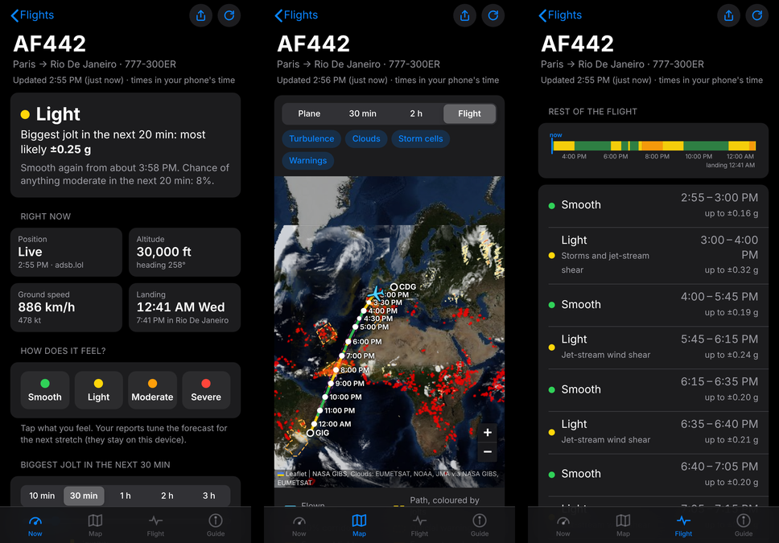

# Turbulence Watch

Live turbulence forecast for any flight. Type a flight number and see where the plane is, where it's headed, every bumpy stretch ahead with times, and how big the jolts will be in g, with the odds.



It uses the forecasts airlines plan with (the ICAO World Area Forecast System), checks them against three independent models, adds official warnings, pilot reports and live satellite storm detection, and turns turbulence intensity into g-forces for your aircraft size and weight.

Not an operational tool. The crew has weather radar, real-time reports from other aircraft and dispatch support, and routes around the worst. Keep your seatbelt fastened whenever you're seated.

## What it does

| | |
|---|---|
| **Position** | Live ADS-B position (adsb.lol, adsb.fi, OpenSky). Over oceans trackers lose the plane, so the app moves it along the projected path from the last fix; you can also set your takeoff time or tap where you are. |
| **Route** | From the flight-number databases (adsbdb, adsb.lol), checked against the plane's position and heading. Stale or reversed routes are caught and flagged, and you can override them. |
| **Projected path** | Great circle to the destination, turning in from the current heading, with climb, cruise and descent speeds. An 80% corridor shows how far real routes stray from that line (about 3% of the distance, pinching to zero at landing). |
| **Clear-air turbulence** | Official WAFS gridded turbulence (EDR) at FL340 and FL390, blended with a GTG-style ensemble on NOAA GFS, ECMWF IFS and ECMWF AIFS (AI model): 8 turbulence diagnostics per model on two cruise layers, quantile-mapped onto the official EDR scale, weighted by your flight level. Weights: WAFS 0.4, IFS 0.25, GFS 0.2, AIFS 0.15. |
| **Storms** | WAFS cumulonimbus tops, a convective proxy from GFS instability, rain and high cloud, the WAFS significant-weather chart, and live satellite storms for the next 3 hours (Meteosat storm objects and MTG lightning; cold cloud tops from GOES-East, GOES-West and Himawari). |
| **Warnings and reports** | International and US SIGMETs (turbulence, thunderstorms, mountain waves, cyclones) in force when you get there, and recent pilot reports near your path and level (NOAA Aviation Weather Center). |
| **g-forces** | EDR becomes peak extra g through a gust-response model scaled by aircraft class (wide-body to turboprop) and by weight, which drops as fuel burns. A Monte Carlo of 4,000 runs adds patchiness and forecast error, giving the distribution of the biggest jolt in the next 10 minutes to 3 hours. |
| **Your reports** | Tap Smooth / Light / Moderate / Severe. A Gaussian process (constant "this plane feels rougher" term plus a 40-minute Matérn term for "the forecast is wrong about this patch") corrects the forecast for the next stretch. Reports stay in your browser. |
| **Rarity** | Each jolt size framed as "about 1 in N flights like yours" and "rougher than X% of cruise time", from airline turbulence statistics. |

## How it works

```mermaid
flowchart LR
  subgraph GitHub Actions, hourly
    A[NOAA AWC: WAFS turbulence, CB tops, SIGWX] --> P[pipeline/fields.py]
    B[NOAA GFS 0.25°] --> P
    C[ECMWF IFS + AIFS open data] --> P
    P -->|global 0.5° grids, ~10 MB| D[(data branch)]
  end
  subgraph Vercel
    E[api/flight] --> F1[adsbdb, adsb.lol, adsb.fi, OpenSky]
    G[api/sample + api/grid] --> D
    G --> H[aviationweather.gov SIGMETs, PIREPs]
    S[public/: static app]
  end
  subgraph Browser
    U[route, path, corridor, forecast blend, Monte Carlo, Gaussian process, map] --> E
    U --> G
    U --> I[EUMETSAT, NASA GIBS satellite tiles]
    U --> L[(localStorage: track, reports)]
  end
```

- **`pipeline/fields.py`** builds the global forecast fields every hour (only when a new WAFS issue or model run is out) and publishes them to the `data` branch: one gzipped 0.5° `uint8` grid per product and valid time, every 3 hours out to 36 hours, plus `manifest.json`. File names carry a content hash, so every file is immutable and cacheable.
- **`api/`** are small Node functions on Vercel. `flight` finds the route and live position, `sample` returns every forecast member, warning and pilot report at the points along a path, `grid` returns map tiles of the blended forecast, `wx` returns warnings in a box.
- **`public/`** is the whole app: plain HTML, CSS and one ES module, no build step. Everything specific to a flight runs in the browser, and the app keeps working on flaky in-flight Wi-Fi (offline shell, last forecast kept locally).

## Deploy your own

1. **Fork or use this repo.** The Action needs write access to push the `data` branch: Settings → Actions → General → Workflow permissions → *Read and write*.
2. **Build the data once.** Actions → *Forecast fields* → *Run workflow* (tick *force*). It takes about 5 minutes and creates the `data` branch. After that it runs every hour by itself.
3. **Import into Vercel.** New Project → import the repo. Framework preset: *Other*. Leave build and output settings empty (`vercel.json` sets the output to `public/`). Deploy.

That's it. The functions read the data branch of whichever repo Vercel deployed from. Optional environment variables:

| Variable | Default | Use |
|---|---|---|
| `DATA_REPO` | the deployed repo | read forecast fields from another repo (`owner/name`) |
| `DATA_BRANCH` | `data` | branch with the fields |
| `DATA_TOKEN` | none | GitHub token with read access, only if the data repo is private |

GitHub disables scheduled workflows in public repos after 60 days without activity; re-enable it from the Actions tab if that happens.

## Run it locally

```bash
pip install -r requirements.txt
python -m pipeline.fields          # writes ./out (TW_HOURS=12 for a quicker build)
DATA_DIR=./out npm run dev         # http://localhost:3000
```

Without `DATA_DIR`, the dev server reads the published `data` branch from GitHub.

## Accuracy and limits

- Turbulence is patchy and forecasts give probabilities, not certainties. The official WAFS product and NCAR's GTG (which this mimics) catch most moderate-or-greater encounters, with false alarms. The g figures are order-of-magnitude estimates; the ranges shown are meant to be read as such.
- The projected path is not the filed flight plan. On oceanic tracks the real route can sit 100–300 km off the great circle; the corridor covers most of that.
- Live satellite storms are searched within a radius that grows with lead time; storms aren't moved with the wind.
- Forecasts cover cruise altitudes (about FL300–FL450). Climb and descent get a simpler treatment.
- Position over oceans is estimated. Arrival times use typical speeds, not the airline's ETA.

## Data sources

ADS-B: [adsb.lol](https://adsb.lol) (ODbL), [adsb.fi](https://adsb.fi), [OpenSky Network](https://opensky-network.org). Routes: [adsbdb](https://www.adsbdb.com), adsb.lol. Forecasts: [NOAA Aviation Weather Center](https://aviationweather.gov) (WAFS, SIGMETs, PIREPs), [NOAA NOMADS GFS](https://nomads.ncep.noaa.gov), [ECMWF open data](https://www.ecmwf.int/en/forecasts/datasets/open-data) (CC BY 4.0). Satellite: [EUMETSAT EUMETView](https://view.eumetsat.int), [NASA GIBS](https://earthdata.nasa.gov/gibs) (GOES via NOAA, Himawari via JMA), Blue Marble base map. Airports: [OurAirports](https://ourairports.com) (public domain), time zones from [mwgg/Airports](https://github.com/mwgg/Airports).

## Privacy

No accounts, no analytics. Flight lookups go through the Vercel functions to the public APIs above. Your track, bump reports and settings are stored only in your browser's local storage.

## License

MIT
